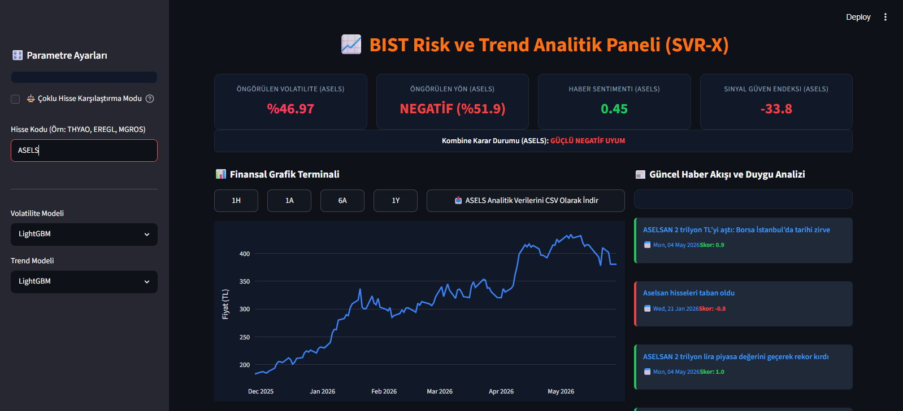

# 📈 BIST Risk ve Trend Analitik Paneli



Borsa İstanbul zaman serilerindeki yüksek rastlantısallığı ve gürültüyü temizleyerek yatırım analistlerine istatistiksel avantaj sağlayan, Yapay Zeka ve Doğal Dil İşleme (NLP) tabanlı hibrit bir **Karar Destek Sistemidir (Decision Support System)**.

---

## 🚀 Proje Özeti
BIST SVR-X; ham borsa verilerini statik dosyalar üzerinden okumak yerine canlı piyasaya bağlayan, ağaç tabanlı güçlü makine öğrenmesi algoritmalarıyla risk/trend analizi yapan ve finansal haberlerin duygu yoğunluğunu ölçen kurumsal bir FinTech altyapısı sunar. Platform, teknik analiz (sayısal) ile temel analizi (sözel) matematiksel bir formülde birleştirir.

---

## 🏗️ Öne Çıkan Mühendislik Katmanları

### 1. Dinamik Veri Hattı (Data Pipeline) & Gelişmiş UX
* **Canlı Akış:** Herhangi bir BIST kodu (Örn: `THYAO`, `EREGL`, `MGROS`) aratıldığında, sistem `yfinance` API'si üzerinden son 5 yıllık veriyi canlı indirir ve bellek üzerinde anlık işler.
* **Çoklu Hisse Karşılaştırma Modu:** Birden fazla enstrüman girildiğinde nominal fiyatlar yerine, başlangıç noktasına göre **yüzdesel performans getirilerini** üst üste bindirerek analitik kıyaslama sunar.
* **Terminal Esnekliği:** Ön yüzde kurgulanan 1 Haftalık, 1 Aylık, 6 Aylık veya 1 Yıllık anlık zaman filtreleri ve işlenmiş tüm teknik verileri tek tıkla **CSV olarak dışa aktarma (Export)** düğmesi mevcuttur.

### 2. Gelişmiş Finansal Matematik (EWMA)
* **Zamana Göre Değişen Risk:** Geçmiş günleri eşit ağırlıkta hesaplayan klasik standart sapma yerine, yakın tarihteki şoklara daha doğru ağırlık veren **EWMA** (RiskMetrics standardı $\lambda = 0.94$ parametresiyle) volatilite modeli entegre edilmiştir. Bu sayede dünün fiyat hareketi, bugün üretilen risk tahminine üstel olarak yansır.

### 3. Endüstriyel MLOps Katmanı (Serialization & Inference)
* **Performans Optimizasyonu:** Kullanıcı her tıkladığında modellerin sıfırdan eğitilmesinin önüne geçmek adına `LightGBM`, `XGBoost` ve `CatBoost` algoritmaları disk üzerine `.joblib` formatında kaydedilir. 
* **Hafif Bellek Yönetimi:** Arayüz tetiklendiğinde eğitim süreci tamamen atlanarak model katsayıları diskten ışık hızında okunur (**Inference Mode**). Bu hamle CPU yükünü sıfıra indirir ve sayfa tepki süresini milisaniyelere düşürür.

### 4. Kombine Sinyal Güven Endeksi
* **Veri Füzyonu:** Google News üzerinden toplanan haberler, tamamen yerel ve hafif bir Türkçe NLP motoruyla duygu analizine (Sentiment) tabi tutulur.
* **Matematiksel Karar Desteği:** Yapay zeka modelinin yön öngörü olasılığı ve backtest başarı oranı (`Accuracy`), haber duygu skoruyla harmanlanarak **-100 ile +100 arasında** analitik bir skor üretir. İki veri kaynağı da düşüşü veya yükselişi desteklediğinde endeks doğrudan renk değiştirerek analisti uyarır.

---

## ⚙️ Kurulum ve Çalıştırma

Projenin bilgisayarınızda yerel olarak çalıştırılması için aşağıdaki adımları takip edebilirsiniz:

```bash
# 1. Depoyu klonlayın
git clone [https://github.com/emirhantozlu/bist-risk-analytics-terminal.git](https://github.com/emirhantozlu/bist-risk-analytics-terminal.git)
cd bist_risk_radar

# 2. Gerekli kütüphaneleri yükleyin
pip install -r requirements.txt

# 3. Streamlit arayüzünü ayağa kaldırın
streamlit run app.py